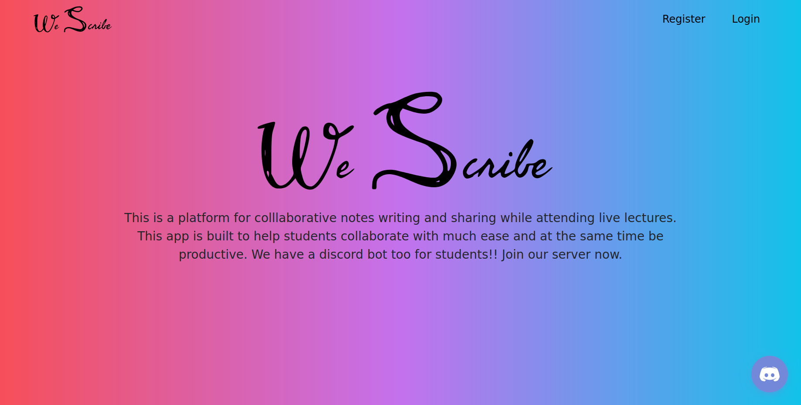
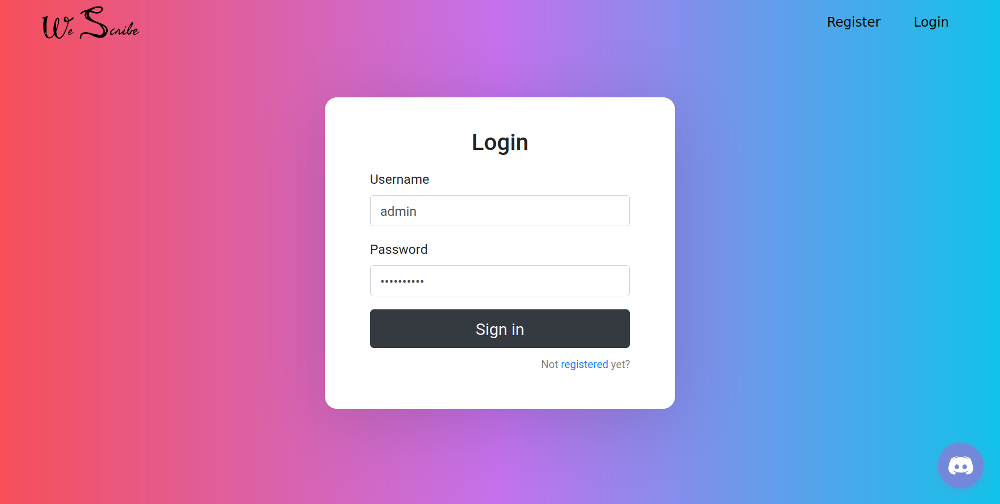
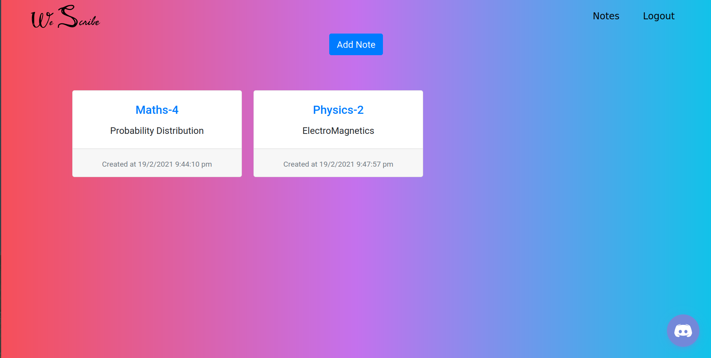
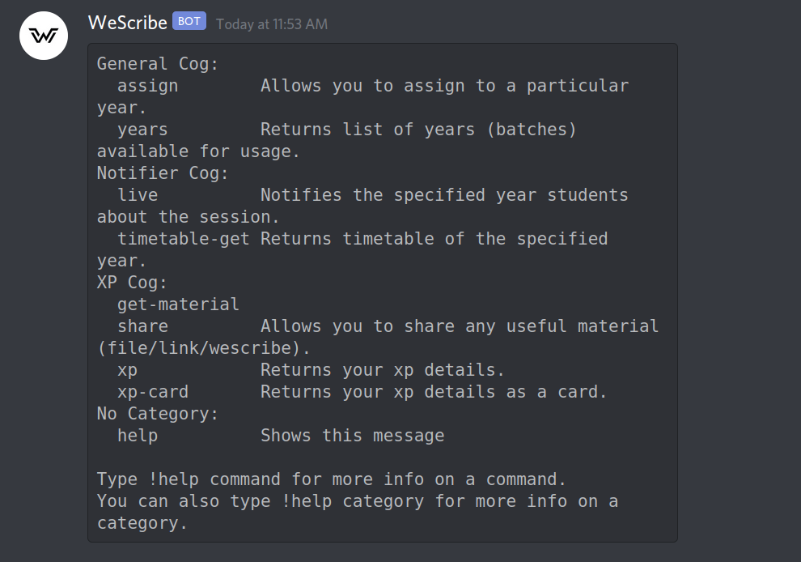
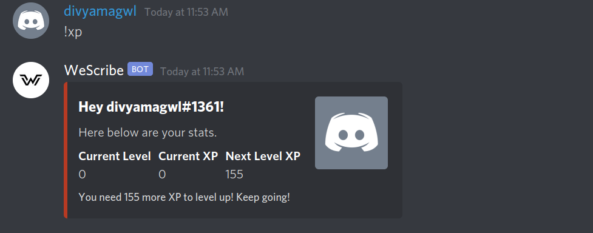

# WeScribe

### Team: Thunderbirds

WeScribe is a platform that allows collaboration while attending live lectures on Zoom or Youtube. 

An added plus is that the collaboration is completely optional and hence the user can also use it to watch the lectures while writing their ideas on the editor. 

To resonate its use even more and increase the participation of students while online learning, we also have a WeScribe discord bot which helps in keeping students motivated and engaged with their fellow peers.

Refer to our [presentation](./WeSribe.pptx) for more details about the idea and the platform.

## Hosting 

The app is hosted on gh-pages at this [Link](https://gaganagarwal77.github.io/WeScribe-Frontend/).

Since the backend is not hosted on cloud , you can run it locally to check the functionalities of Register, Login and Notes Saving.To run the backend locally please refer to the readme of the linked Backend repo.

To see other functionalaties of this application without installing anything you can follow the following steps:

- Head over to this [Link](https://gaganagarwal77.github.io/WeScribe-Frontend/board).
- This will open up a collaborative editor, you can even share your board's url with your friends to collaborate while watching a live lecture or youtube video.
- You will find a discord bot widget at bottom right corner of the screen. Clicking on this opens up a discord server in the widget you will find there the link to join the server.
- Authorize yourself with discord and now you are set. You can use the widget to share your thoughts and ideas and even your notes which will earn you some XP . The Bot will also notify you of your classes based on uploaded timetable :)

## Screenshots

